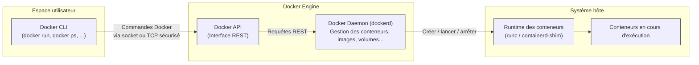

Docker is a platform-as-a-service solution that delivers software in packages called containers. The Docker daemon (dockerd) exposes a REST API that allows remote management of Docker containers, images, and other resources.

When the Docker daemon is configured to listen on a network port (typically TCP port 2375) without proper authentication mechanisms, attackers can gain unauthorized access to the Docker API. This vulnerability allows attackers to create, modify, and execute containers on the host system, potentially leading to remote code execution, data theft, and complete host system compromise.

- https://docs.docker.com/engine/security/protect-access/
- https://tttang.com/archive/357/

## **Préalables**

**Docker** : PaaS qui permet de délivrer des logiciels dans des conteneurs. 

Un conteneur contient tout ce qu'il faut pour que le logiciel fonctionne (codes sources, dépendances, etc.)

**Les 3 piliers de l’architecture Docker :**

- **Docker CLI** : l’interface avec laquelle tu tapes tes commandes (`docker run`, `docker ps`, etc.)
- **Docker Daemon (`dockerd`)** : le moteur principal, qui exécute réellement les conteneurs
- **Docker API** : la passerelle entre le CLI et le Daemon (une interface REST)

## **Quelle est la vulnérabilité?**

## **On peut faire quoi quand la vulnérabilités est exploitée ?**

Un attaquant peut : 

- créer, 
- modifier,
- et executer 

des conteneurs sur le système hote

## **Démonstration**

## **Mesures de mitigations**

## **Preuve que les mesurent marches** 