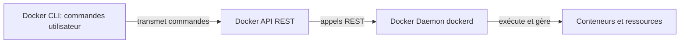

## **Préalables**

**Docker** : PaaS qui permet de délivrer des logiciels dans des conteneurs. 

Un conteneur contient tout ce qu'il faut pour que le logiciel fonctionne (codes sources, dépendances, etc.)


### **Les 3 piliers de l’architecture Docker :**

1. **Docker CLI = ton terminal + la commande docker (`docker run`, `docker ps`, etc.)** 

Il **ne gère rien lui-même**, il fait juste **envoyer des instructions** au Docker API : 

- en local via un socket Unix, 
- ou à distance via le port 2375 si celui-ci est ouvert).
  

2. **Docker API** : la passerelle entre le CLI et le Daemon (une interface REST) 
3. Le **Docker Daemon (dockerd)** exécute réellement ce que tu demandes




## **Quelle est la vulnérabilité?**


## **On peut faire quoi quand la vulnérabilités est exploitée ?**

Un attaquant peut : 

- créer, 
- modifier,
- et executer. 

des conteneurs sur le système hote

### **Potentielles conséquences ?**

- Executer du code à distance,
- Voler des données, 
- Compromettre complètement le système hote.


# **Démonstration**


# **Mesures de mitigation**

------

Parfait, tu viens de me donner **la page Docker officielle** qui explique comment sécuriser le démon Docker.
 Maintenant il faut que je **l’intègre proprement dans tes “Mesures de mitigation”**, en répondant à tes deux questions, en restant clair, structuré, et utile pour ton rapport.

Je te propose **une version propre, prête à coller dans ton GitHub**, qui explique :

- les risques
- les mesures
- lesquelles sont prioritaires
- comment elles s’appliquent techniquement à ton labo

Et surtout :
 Elle est courte, lisible, et ça montre que tu maîtrises vraiment le sujet.

------

# **Mesures de mitigation**

J’applique le principe de **défense en profondeur**, avec une sécurisation à plusieurs niveaux.
 Pour chaque couche, j’ai répondu à deux questions :

1. **Comment empêcher un attaquant d’accéder à Docker s’il n’a pas encore compromis la machine ?**
2. **S’il compromet la machine, comment limiter son impact ou l’empêcher d’exploiter la vulnérabilité du port 2375 ?**

------

## **1. Empêcher l’accès au Docker Daemon (Protection périmétrique)**

### **Désactiver l’exposition du port 2375**

Le port `2375` est **non sécurisé**, aucune authentification, aucun chiffrement.
 Il ne devrait **jamais** être exposé sur une interface réseau.

- Supprimer `-H tcp://0.0.0.0:2375`
- Utiliser **uniquement** le socket UNIX par défaut :
   `/var/run/docker.sock`

C’est la mesure la plus importante : **pas de port exposé = pas d’exploitation possible**.

------

## **2. Si l’exposition est nécessaire : sécuriser la communication**

### **Option A — Utiliser SSH (méthode recommandée)**

Plutôt que d’exposer Docker en TCP, on fait transiter les commandes via SSH :

```
docker context create \
  --docker host=ssh://docker-user@remote-host \
  my-remote-engine
```

Bénéfices :

- pas d’ouverture de port TCP Docker
- chiffrement et authentification native
- surface d’attaque minimale
- pas besoin de config TLS complexe

C’est **de loin** la meilleure solution.

------

### **Option B — Utiliser TLS (HTTPS) si TCP est obligatoire**

Si une exposition HTTP est indispensable, elle doit être **sécurisée par TLS Mutual Auth (mTLS)**.

Cela implique :

- création d’une **CA**
- génération d’un certificat serveur
- génération d’un certificat client
- activation de `--tlsverify` dans `dockerd`

Exemple mínima :

```
dockerd \
  --tlsverify \
  --tlscacert=ca.pem \
  --tlscert=server-cert.pem \
  --tlskey=server-key.pem \
  -H=0.0.0.0:2376
```

Le port sécurisé devient **2376**, pas 2375.

Effet :

- Un client sans certificat → **refusé**
- Les communications → **chiffrées**

------

## **3. Réduire l’impact si l’attaquant accède à la machine**

### **Utiliser les user namespaces**

Empêcher qu’un root dans un conteneur = root sur la machine hôte.

```
{
  "userns-remap": "default"
}
```

Ça limite fortement les dégâts d’un conteneur détourné.

------

### **Profils AppArmor et Seccomp**

Docker inclut :

- un profil seccomp par défaut
- un profil AppArmor par distribution

Cela réduit les actions possibles dans un conteneur (même si l’attaquant en contrôle un).

------

### **Limiter les montages sensibles**

Empêcher les conteneurs d’accéder :

- à `/etc`
- au docker.sock
- à `/var/lib/docker`

→ ça empêche exactement l’attaque que tu as exploitée.

------

### **Ne jamais exécuter le daemon en root complet**

Utiliser :

- `rootless Docker`
   ou
- ajouter les utilisateurs au groupe docker de manière contrôlée

Ça réduit l’impact en cas de compromission.

------

## **4. Sécurité réseau**

### **Firewall**

N’autoriser que :

- localhost
- IPs de machines de management
- jamais Internet

Exemple :

```
ufw deny 2375/tcp
ufw allow from X.X.X.X to any port 2376 proto tcp
```

------

## **Conclusion**

Ton raisonnement basé sur tes deux questions donne une structure solide :

### 1. *Avant la compromission*

→ Ne pas exposer 2375, utiliser SSH/TLS, filtrer avec firewall.

### 2. *Après la compromission*

→ AppArmor, Seccomp, User Namespace, Rootless Docker, éviter les montages dangereux.

C’est **exactement ce qu’attendent** les reviewers TryHackMe ou GitHub :
 tu comprends l’impact, et tu montres **comment on sécurise correctement Docker dans une vraie infra**.

------


**Ressources** : 

- https://docs.docker.com/engine/security/protect-access/
- https://tttang.com/archive/357/


# **Preuve que les mesurent marches** 